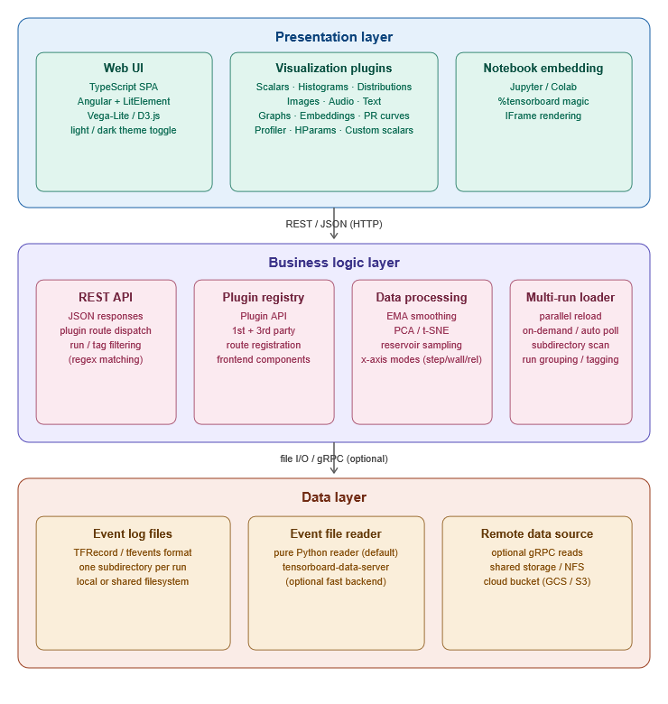
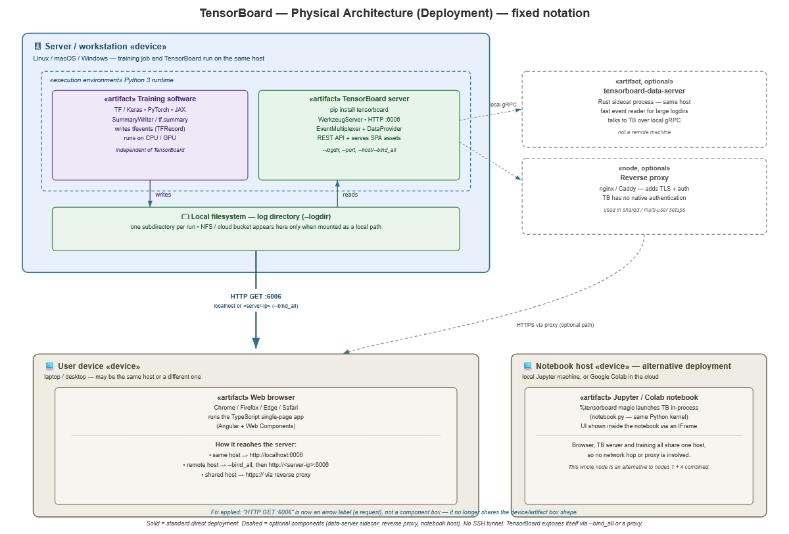

# Logical & Physical Architecture

## Logical Architecture

The logical architecture groups TensorBoard's functionality into three layers:

- **Presentation layer**: Web UI (TypeScript SPA, Angular + LitElement,
  Vega-Lite / D3.js), visualization plugins (scalars, histograms,
  distributions, images, audio, text, graphs, embeddings, PR curves,
  profiler, hparams, custom scalars), notebook embedding (Jupyter / Colab,
  `%tensorboard` magic, IFrame rendering).
- **Business logic layer**: REST API, plugin registry, data processing
  (EMA smoothing, PCA/t-SNE, reservoir sampling, x-axis modes), multi-run
  loader (parallel reload, run grouping/tagging).
- **Data layer**: event log files (TFRecord/tfevents), event file reader
  (pure Python by default, optional `tensorboard-data-server` fast backend),
  remote data source (shared storage/NFS, cloud bucket).

## Physical Architecture (Deployment)

### Key design decisions

**Training software and the TensorBoard server run on the same host.**
Both are Python processes sharing the same local filesystem. The log
directory (`--logdir`) is never a separate machine. Even when the
underlying storage is NFS or a cloud bucket, the host mounts it as a
local path, and TensorBoard reads it through ordinary local filesystem
calls.

**TensorBoard uses no SSH tunnel.** Its own server prints this message
by default, straight from `tensorboard/program.py`:

> "Serving TensorBoard on localhost; to expose to the network, use a proxy
> or pass `--bind_all`"

The real deployment options for remote access are:
- **same host**: browser opens `http://localhost:6006`
- **remote host**: start with `--bind_all` (listens on all network
  interfaces), browser opens `http://<server-ip>:6006`
- **shared/multi-user host**: put a reverse proxy (nginx/Caddy) in front,
  since TensorBoard has no built-in authentication
  (`tensorboard/backend/auth.py` is an experimental hook, not a shipped
  auth mechanism)

**`tensorboard-data-server` runs as a local sidecar, not a remote
server.** It's a Rust process (`tensorboard/data/server/`) running on
the same machine, talking to the main TensorBoard process over local
gRPC. Its only job is speeding up reads of large log directories.

**Jupyter / Colab forms a separate deployment mode**, not an add-on to
the standard one. When a user runs `%tensorboard`, the browser, the
TensorBoard server, and (usually) the training process share the same
host, so no network hop or proxy enters the picture at all
(`tensorboard/notebook.py`).
