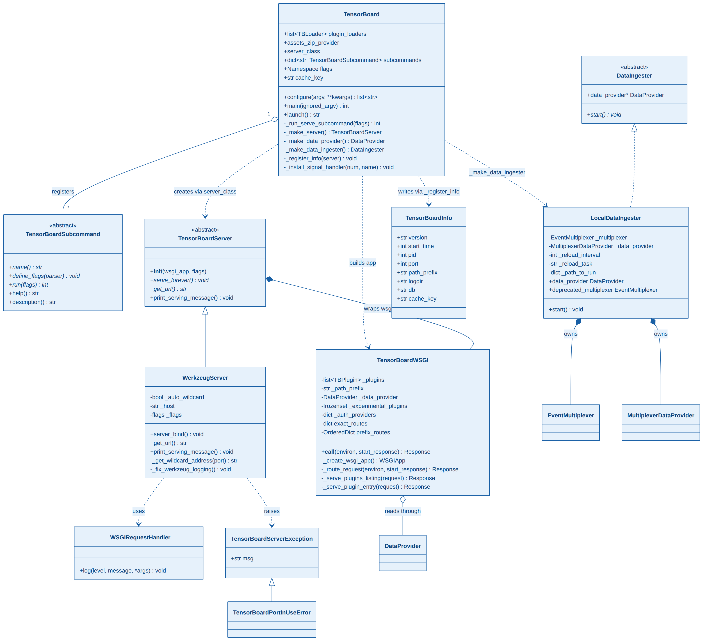
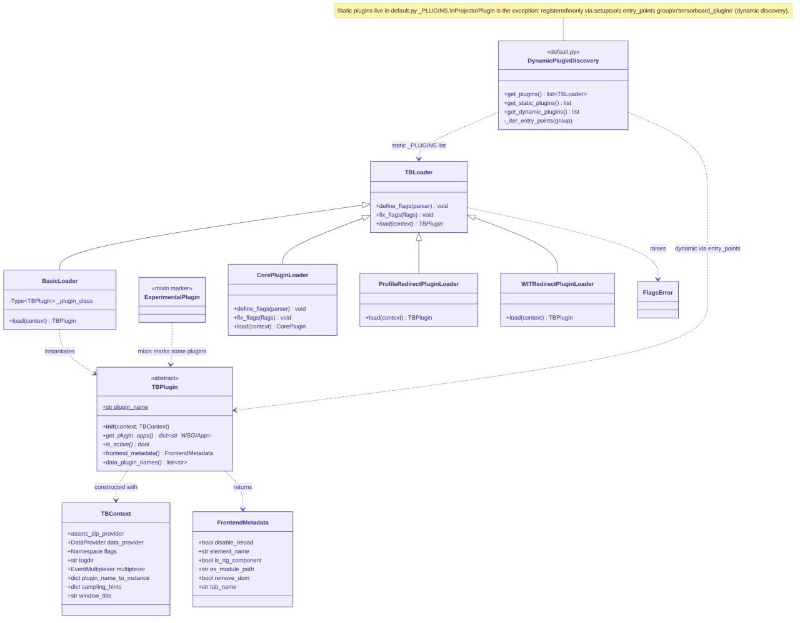
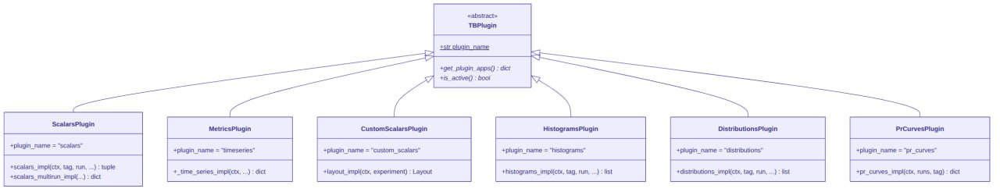
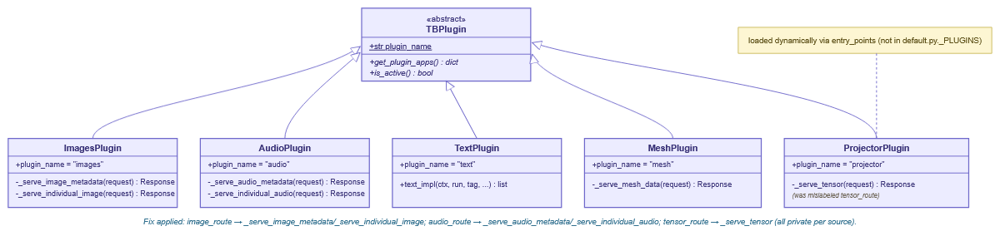
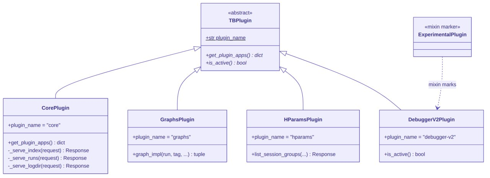
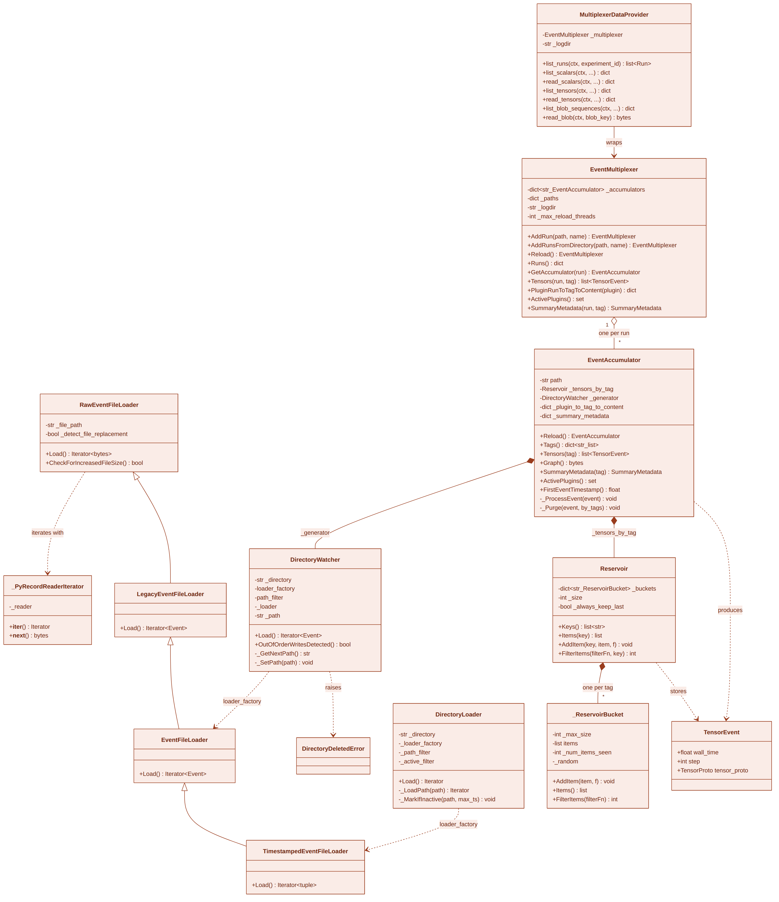
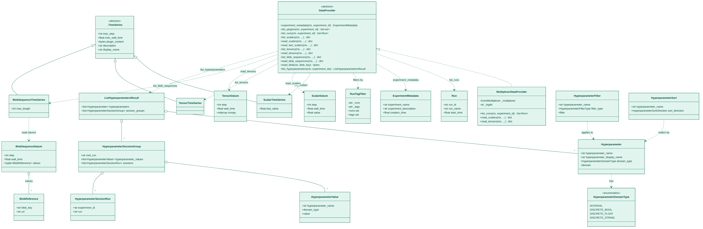

# Class Diagrams

I reverse-engineered every diagram below from the actual TensorBoard
source, not from the World & Machine Model. Where a diagram's drawn
field visibility (`+`/`-`) doesn't match what the real source declares,
I call it out explicitly instead of silently "fixing" it, so you can
read the diagram alongside the ground truth.

## 1. Bootstrap & Server

This diagram covers the process entry point and the HTTP serving layer.

- **`TensorBoard`** (`tensorboard/program.py`): the top-level object
  built by the CLI or the `tensorboard.program.TensorBoard()` API. It
  holds `plugin_loaders`, `flags`, `cache_key`, and drives
  `configure()` through `main()` to `launch()`.
  - **`_make_data_provider()` returns a tuple**: `(data_provider,
    deprecated_multiplexer)`. The multiplexer sticks around only for
    legacy plugins that haven't migrated to the `DataProvider`
    interface. It's deprecated, not removed, and both values thread
    through to `TensorBoardWSGI`.
  - **`_make_data_ingester()`** picks a concrete `DataIngester`
    subclass. The diagram pictures only **`LocalDataIngester`**, but the
    real hierarchy has three subclasses, chosen by flags:
    - `LocalDataIngester`: the default; reads the logdir in-process via
      `EventMultiplexer` (the path the rest of this document follows).
    - `SubprocessServerDataIngester`: used when `--load_fast=true` (the
      default since TB 2.11); spawns the Rust `tensorboard-data-server`
      as a **child process** and talks to it over local gRPC. Its
      lifecycle runs independent of the Python reload loop described in
      [system-dynamics.md](system-dynamics.md).
    - `ExistingServerDataIngester`: used with `--grpc_data_provider
      <addr>`; connects to an already-running data server instead of
      spawning one.
- **`TensorBoardServer`** (abstract) / **`WerkzeugServer`**: the actual
  WSGI HTTP server (`werkzeug.serving`), created via `server_class`.
- **`TensorBoardWSGI`** (`tensorboard/backend/application.py`): the WSGI
  app itself. It holds the plugin list, `_data_provider`, `exact_routes`,
  and `prefix_routes`, and dispatches requests in `_route_request()`.
- **`TensorBoardInfo`**: the small info file (pid, port, logdir, version)
  written to the user's temp directory, so a `tensorboard --logdir`
  invocation in a new shell can detect an already-running instance.
- **`LocalDataIngester`** owns both an `EventMultiplexer` and a
  `MultiplexerDataProvider` wrapping it. See
  [diagram 3](#3-event-ingestion-pipeline).

## 2a. Plugin Framework

This diagram covers how plugins get discovered, loaded, and handed their
execution context (`tensorboard/plugins/base_plugin.py`,
`tensorboard/default.py`).

- **`TBPlugin`** (abstract): the base class every plugin implements:
  `plugin_name`, `get_plugin_apps()`, `is_active()`, plus
  `frontend_metadata()` and `data_plugin_names()`.
- **`TBLoader`**: an indirection layer between a plugin class and its
  construction; `load(context)` returns a `TBPlugin` instance.
  `BasicLoader` is the default and wraps a plugin class directly.
  `CorePluginLoader`, `ProfileRedirectPluginLoader`, and
  `WITRedirectPluginLoader` handle plugins with nonstandard construction
  or redirect behavior.
- **`TBContext`**: the dependency bag passed into every `load()`:
  `data_provider`, `flags`, `logdir`, `multiplexer`,
  `plugin_name_to_instance`, `sampling_hints`, `window_title`.
- **`DynamicPluginDiscovery`**: `get_plugins()` returns
  `get_static_plugins()` (the hardcoded list in `default.py._PLUGINS`)
  plus `get_dynamic_plugins()`, which iterates the
  `'tensorboard_plugins'` setuptools entry-points group.
  - **`ProjectorPlugin` is the one first-party exception**: it doesn't
    sit in `default.py._PLUGINS`. It registers itself via the
    `tensorboard_plugins` entry-point and loads dynamically the same way
    a third-party plugin would. That's why the diagram marks it with a
    dashed "dynamic via entry_points" edge into `TBLoader` instead of the
    solid "static `_PLUGINS` list" edge the other loaders use.
- **`ExperimentalPlugin`**: a marker mixin with no members, not a
  loader. A plugin class inherits it to get flagged experimental at
  discovery time (see `DebuggerV2Plugin` in
  [diagram 2d](#2d-structural--core-plugins)).
- **`FlagsError`**: raised by loaders during `define_flags()` /
  `fix_flags()` validation, before any plugin gets constructed.

## 2b. Timeseries Plugins

All of these extend `TBPlugin` and live under `tensorboard/plugins/`:

- **`ScalarsPlugin`** (`plugin_name = "scalars"`): single-tag scalar
  series; `scalars_impl` / `scalars_multirun_impl`.
- **`MetricsPlugin`** (`plugin_name = "timeseries"`): backs the unified
  Time Series dashboard (the default view since TB 2.10), which
  consolidates scalars, histograms, and images into one timeline UI.
- **`CustomScalarsPlugin`** (`plugin_name = "custom_scalars"`): lets
  users define chart layouts grouping multiple scalar tags
  (`layout_impl`).
- **`HistogramsPlugin`** / **`DistributionsPlugin`**: two different
  renderings, stacked bars versus offset area, of the same underlying
  compressed-histogram data.
- **`PrCurvesPlugin`** (`plugin_name = "pr_curves"`): precision/recall
  curve data over discretized thresholds.

## 2c. Media Plugins

- **`ImagesPlugin`**, **`AudioPlugin`**: serve metadata plus binary blob
  routes (`_serve_image_metadata`/`_serve_individual_image`,
  `_serve_audio_metadata`/`_serve_individual_audio`).
- **`TextPlugin`**: Markdown-capable text snippets (`text_impl`).
- **`MeshPlugin`**: 3D mesh/point-cloud data (`_serve_mesh_data`).
- **`ProjectorPlugin`**: embedding projector (PCA/t-SNE); `_serve_tensor`
  is the private route handler. As [2a](#2a-plugin-framework) notes,
  this plugin loads dynamically via entry-points, not statically from
  `default.py._PLUGINS`, even though it sits in the source tree
  alongside the other first-party media plugins.

## 2d. Structural / Core Plugins

- **`CorePlugin`** (`plugin_name = "core"`): not a visualization plugin;
  it serves the SPA shell itself (`_serve_index`, `_serve_runs`,
  `_serve_logdir`). Every TensorBoard instance has exactly one.
- **`GraphsPlugin`**: GraphDef parsing/serving (`graph_impl`).
- **`HParamsPlugin`**: hyperparameter table (`list_session_groups`); see
  the hyperparameter domain model in
  [diagram 4](#4-data-provider-domain-model).
- **`DebuggerV2Plugin`**: marked with the `ExperimentalPlugin` mixin from
  [2a](#2a-plugin-framework); `is_active()` gates it off unless
  debugger-v2 data is present.

## 3. Event Ingestion Pipeline

This diagram traces the path from `.tfevents` files on disk to in-memory
`TensorEvent`s (`tensorboard/backend/event_processing/*`).

- **`EventMultiplexer`**: one per `LocalDataIngester`; owns a
  `dict<str, EventAccumulator>` keyed by run name and coordinates
  `Reload()` across all of them (optionally in parallel via
  `_max_reload_threads`).
  - **Diagram correction**: the box shows `-str _logdir`, but the real
    source gives `EventMultiplexer` **no `_logdir` field**. It tracks
    only per-run paths in `_paths`. The `_logdir` attribute belongs
    exclusively to **`MultiplexerDataProvider`** (see
    [diagram 4](#4-data-provider-domain-model)), which wraps the
    multiplexer and remembers the root logdir for its own routing
    needs. The multiplexer itself never knows its root directory.
- **`EventAccumulator`**: one per run (composition, multiplicity 1-to-*
  on the diagram). It reads events for a single run directory and
  buckets them by tag.
  - **Public fields** (the diagram draws them with `-` for layout
    compactness, but the real class exposes them as plain public
    attributes): `path`, `tensors_by_tag`, `summary_metadata`. External
    code, including tests and other plugins, reads `accumulator.path`
    and `accumulator.summary_metadata` directly, with no accessor in
    the way.
  - **`tensors_by_tag`** is a `dict<tag, Reservoir>`: one `Reservoir`
    instance per tag, not one shared reservoir for the whole run. Each
    tag gets its own independent sampling budget.
  - **`_generator`** isn't constructed directly. The module-level
    factory **`_GeneratorFromPath()`** builds it, inspecting the given
    path and returning one of three loader types:
    1. an **`EventFileLoader`** directly, if the path names a single
       event file;
    2. a **`DirectoryLoader`**, if the path names a directory containing
       one or more event files, itself built on top of an
       `EventFileLoader`/`TimestampedEventFileLoader` `loader_factory`;
    3. a **`DirectoryWatcher`**, which wraps whichever of the above the
       `loader_factory` produces, adds polling, detects new files
       appearing in the directory, and raises
       `DirectoryDeletedError` if the run directory disappears
       mid-watch.
  - `EventFileLoader` itself sits on top of `LegacyEventFileLoader` /
    `RawEventFileLoader`, which use `_PyRecordReaderIterator` to read
    raw TFRecord bytes.
- **`Reservoir`**: implements reservoir sampling, `dict<str,
  _ReservoirBucket>` keyed by tag, one `_ReservoirBucket` per tag.
  - **Public fields**: `size` and `always_keep_last` are plain public
    attributes (again drawn with `-` for compactness). `size` caps the
    items retained per bucket; `always_keep_last=True` guarantees the
    most recent item survives sampling regardless of bucket size.
- **`TensorEvent`**: the leaf value, holding `wall_time`, `step`,
  `tensor_proto`. `EventAccumulator._ProcessEvent()` produces it and
  stores it into the matching tag's `Reservoir`.

## 4. Data Provider Domain Model

This diagram covers the provider-facing domain model
(`tensorboard/data/provider.py`), which decouples plugins from the
`EventMultiplexer` implementation detail.

- **`DataProvider`** (abstract): the interface every plugin actually
  programs against: `list_runs`, `list_scalars`/`read_scalars`,
  `list_tensors`/`read_tensors`, `list_blob_sequences`/`read_blob`,
  `list_hyperparameters`, `experiment_metadata`.
- **`MultiplexerDataProvider`**: currently the only production
  implementation; wraps an `EventMultiplexer` and holds **`_logdir`**
  (see the diagram-3 correction above: this is the one and only place
  `_logdir` lives in this pipeline).
- **`_TimeSeries`** (abstract), with subclasses `ScalarTimeSeries`,
  `TensorTimeSeries`, and `BlobSequenceTimeSeries`: per-tag series
  metadata (`max_step`, `max_wall_time`, `plugin_content`,
  `description`, `display_name`).
- **`ScalarDatum`** / **`TensorDatum`** / **`BlobSequenceDatum`**: the
  actual per-step values `read_*` returns. `BlobSequenceDatum` holds a
  tuple of `BlobReference`s rather than inline bytes, since blob
  payloads (images/audio/tensors) get fetched separately via
  `read_blob(blob_key)`.
- **`Run`** / **`ExperimentMetadata`** / **`RunTagFilter`**: the request
  side of the API, specifying which run/tag combinations a caller wants.
- **Hyperparameter domain model**: `Hyperparameter` (with
  `HyperparameterDomainType` enum values `INTERVAL`, `DISCRETE_BOOL`,
  `DISCRETE_FLOAT`, `DISCRETE_STRING`), `HyperparameterValue`,
  `HyperparameterSessionGroup`/`HyperparameterSessionRun`,
  `HyperparameterFilter`/`HyperparameterSort` for querying, and
  `ListHyperparametersResult` as the aggregate response
  `HParamsPlugin` consumes ([2d](#2d-structural--core-plugins)).
