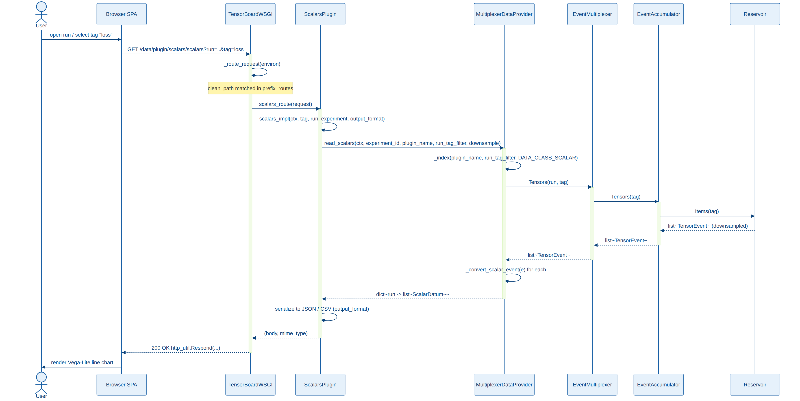
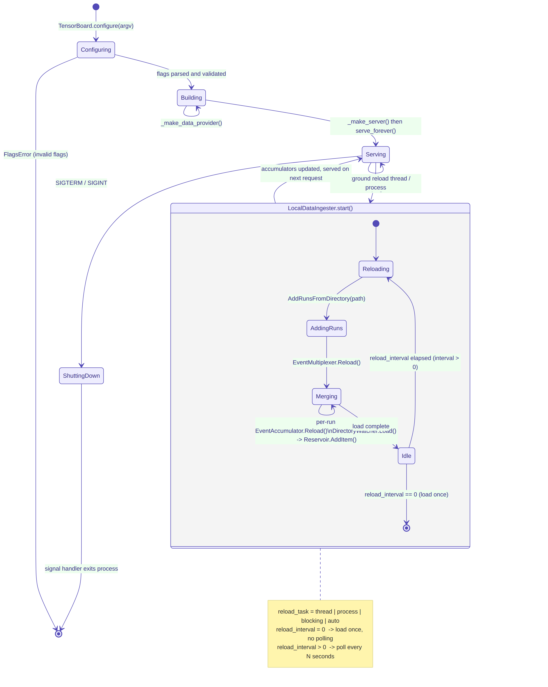
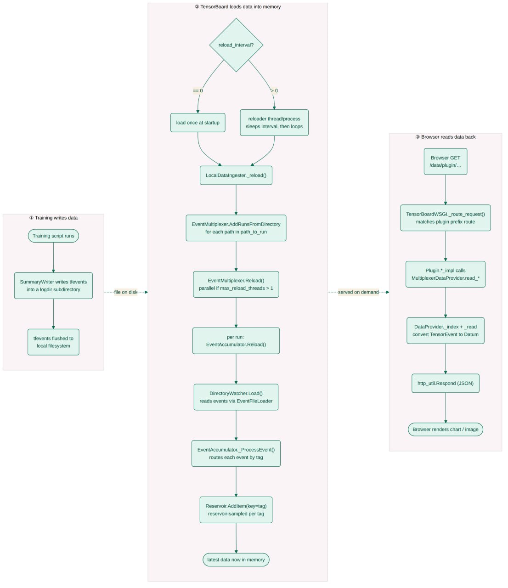

# System Dynamics Diagrams

## Sequence: Reading a Scalar Series

This diagram traces a single browser request end-to-end: `Browser SPA` →
`TensorBoardWSGI` → `ScalarsPlugin` → `MultiplexerDataProvider` →
`EventMultiplexer` → `EventAccumulator` → `Reservoir`.

1. The browser opens a run and tag ("loss"), sending `GET
   /data/plugin/scalars/scalars?run=..&tag=loss`.
2. `TensorBoardWSGI._route_request()` matches the path against
   `prefix_routes` and dispatches into `ScalarsPlugin.scalars_route()`.
3. `ScalarsPlugin.scalars_impl()` calls
   `MultiplexerDataProvider.read_scalars()`. The plugin talks to the
   `DataProvider` interface here, not to the multiplexer directly (see
   [class-diagrams.md, §4](class-diagrams.md#4-data-provider-domain-model)).
4. `MultiplexerDataProvider._index()` resolves which `(run, tag)` pairs
   match the request's `RunTagFilter` and `DATA_CLASS_SCALAR`, then calls
   `EventMultiplexer.Tensors(run, tag)`.
5. The call descends into one `EventAccumulator` (the one owning that
   run), then its per-tag `Reservoir`, then `Items(tag)`, which returns
   the already-downsampled `list<TensorEvent>` for that tag.
6. `MultiplexerDataProvider._convert_scalar_event()` maps each
   `TensorEvent` to a `ScalarDatum`, returning `dict<run,
   list<ScalarDatum>>` back up the chain.
7. `ScalarsPlugin` serializes the result to JSON, or CSV if the caller
   requested `output_format=csv`, and returns `(body, mime_type)`.
8. `TensorBoardWSGI` responds via `http_util.Respond(...)`, and the
   browser renders the Vega-Lite line chart.

No file I/O happens on this path. It only reads whatever the `Reservoir`
currently holds. Getting new data into the reservoirs is the job of the
reload cycle covered next.

## State: Server & Data-Loading Lifecycle

Two state machines appear here, one nested inside the other.

**Outer machine, the TensorBoard process itself**: `Configuring` →
`Building` → `Serving` → `ShuttingDown`. A `FlagsError` short-circuits
`Configuring` straight to termination, and SIGTERM/SIGINT drives
`Serving` into `ShuttingDown`. `_make_data_provider()` and
`_make_server()` run during `Building`. `Serving` is where
`serve_forever()` blocks the main thread while a background reload task
runs alongside it.

**Inner machine, `LocalDataIngester.start()`'s reload cycle**, nested
inside `Serving`: `Reloading` → `AddingRuns` → `Merging` → `Idle`.

These four states are stages of one data-loading pass, not categories
of external event. Every reload, whether it's the first load at startup
or the Nth periodic poll, walks through all four in order:

- **`Reloading`**: the entry point of the cycle; nothing read yet.
- **`AddingRuns`**: `EventMultiplexer.AddRunsFromDirectory(path)` walks
  the logdir and registers any new run subdirectories it hasn't seen
  before, and each becomes or updates an `EventAccumulator`. This stage
  touches directory structure only; no event content gets read yet.
- **`Merging`**: `EventMultiplexer.Reload()` fans out to every
  `EventAccumulator.Reload()`, and this is where the actual
  `.tfevents` files get read via each accumulator's
  `DirectoryWatcher`/`EventFileLoader` chain. This stage reads
  scalars, images, histograms, audio, whatever summary types the run's
  event files contain, and feeds each parsed value into the matching
  tag's `Reservoir.AddItem()`. Reservoir sampling happens here, per tag,
  as each item arrives.
- **`Idle`**: the pass has finished; accumulators and reservoirs now
  reflect the latest on-disk state. From `Idle`, the machine loops back
  to `Reloading` if `reload_interval > 0` (periodic polling stays on),
  or terminates if `reload_interval == 0` ("load once at startup" mode,
  the default since TB 2.3).

"Merging" doesn't mean "merging runs together" as an event type. It
means the merge-new-events-into-existing-reservoirs stage of the
current reload pass, and that holds identically on pass 1 and pass 50.

**Scope note**: this inner machine describes the `LocalDataIngester`
path only, the default in-process Python reload loop. When someone
starts TensorBoard with `--load_fast` (the default since 2.11) or
`--grpc_data_provider`, ingestion instead runs through
`SubprocessServerDataIngester` / `ExistingServerDataIngester` (see
[class-diagrams.md, §1](class-diagrams.md#1-bootstrap--server)), which
hands reload responsibility to the separate Rust
`tensorboard-data-server` process entirely. That process runs its own
internal lifecycle, not pictured here, and reports results back over
local gRPC instead of through `EventMultiplexer.Reload()`.

## Activity: End-to-End Data Flow

Three swimlanes tie the sequence and state diagrams together:

1. **Training writes data**: the training script's `SummaryWriter`
   writes `.tfevents` records into a logdir subdirectory. This runs
   fully decoupled from TensorBoard: no coupling, no signal, just a
   file appearing and growing on disk.
2. **TensorBoard loads data into memory**: the `reload_interval` branch
   (`== 0` for load-once, `> 0` for poll-loop) both funnel into
   `LocalDataIngester._reload()`, the same `Reloading` → `AddingRuns` →
   `Merging` → `Idle` cycle from the state diagram above, ending with
   the reservoirs holding "latest data now in memory."
3. **Browser reads data back**: a GET request runs through
   `TensorBoardWSGI._route_request()` → plugin `*_impl` →
   `DataProvider._index` + `_read` → `http_util.Respond` → chart render,
   the same path the sequence diagram above traces step by step.

The dotted "file on disk" / "served on demand" connectors between lanes
make it explicit that lanes 1 and 3 never talk to each other directly.
Lane 2, the reload cycle, forms the only bridge between what training
writes and what the browser can see, and it runs on its own schedule,
independent of any particular browser request.
